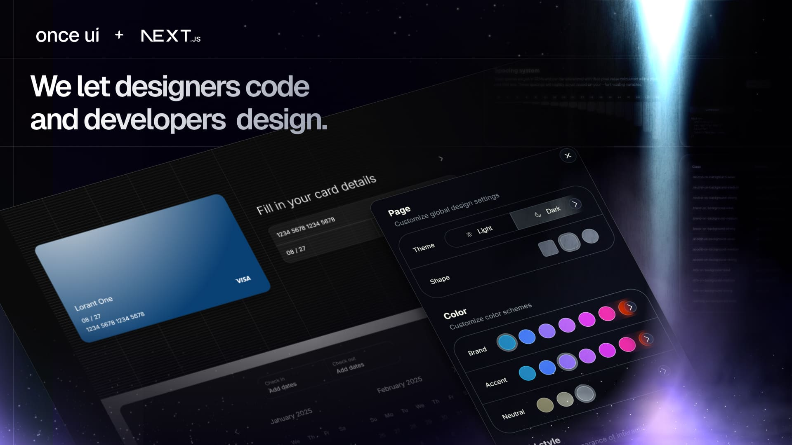
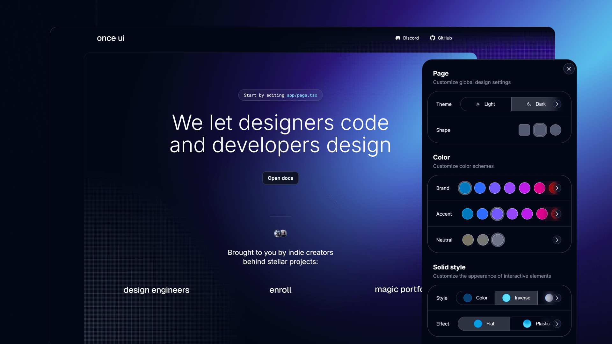

# Once UI for Next.js

A design system for indie builders who move fast and break limits without neglecting quality.



 
# Features

Start building your Next.js app in minutes with: 
* **A robust token and style system** that simplifies customization and ensures consistency. 
* **A copy-and-paste component library** that integrates seamlessly into your project.
* **Interactive documentation** to apply your branding and set component properties.

# Demo
[demo.once-ui.com](https://demo.once-ui.com)



# Getting started
Clone the starter template from GitHub.
```bash
git clone https://github.com/once-ui-system/nextjs-starter.git
```

You can also deploy it directly to Vercel.

[](https://vercel.com/new/clone?repository-url=https%3A%2F%2Fgithub.com%2Fonce-ui-system%2Fnextjs-starter&redirect-url=https%3A%2F%2Fonce-ui.com%2Fdocs%2F)


View the step-by-step guide at [once-ui.com/docs](https://once-ui.com/docs).

# Documentation
[once-ui.com/docs](https://once-ui.com/docs)

# Authors
Connect with us!

Lorant One: [Site](https://lorant.one), [Threads](https://www.threads.net/@lorant.one), [LinkedIn](https://www.linkedin.com/in/lorant-one/)  
Zsofia Komaromi: [Site](https://zsofia.pro), [Threads](https://www.threads.net/@zsofia_kom), [LinkedIn](https://www.linkedin.com/in/zsofiakomaromi/)

# Get involved
- Join the [Design Engineers Club](https://discord.com/invite/5EyAQ4eNdS) on Discord to connect with designers, developers and share your projects.
- Report a [bug](https://github.com/once-ui-system/nextjs-starter/issues/new?labels=bug&template=bug_report.md).
- Submit a [feature request](https://github.com/once-ui-system/nextjs-starter/issues/new?labels=feature%20request&template=feature_request.md).

# License

Distributed under the MIT License. See `LICENSE.txt` for more information.

# Sponsors

[github.com/sponsors/once-ui-system](https://github.com/sponsors/once-ui-system)

Become a sponsor and help us continue to develop and maintain this project.

# Once UI for Figma

Once UI is also available for Figma.  
Design and prototype entire products from scratch in hours. Use the same tokens and components as the Next.js design system.

Start designing: [once-ui.com/figma](https://once-ui.com/figma)

# Once UI Pro

Take your project further with Once UI Pro. Get access to complete templates, fully designed pages, and modular blocks that make building apps even faster.

Explore Pro: [once-ui.com/pro](https://once-ui.com/pro)


# Sourceful.space

A collaborative platform to explore and contribute to **`open-source`** projects. 🚀

Sourceful.space is an **`open-source`** initiative aimed at creating a central hub for developers, contributors, and enthusiasts to discover, connect, and collaborate on **`open-source`** projects. This repository contains the codebase for the platform, designed to be scalable, modular, and community-driven. 🌟

## table of contents

1. [about the project](#about-the-project)
2. [features](#features)
3. [how it works](#how-it-works)
4. [contributing](#contributing)
5. [future roadmap](#future-roadmap)

## about the project

**`Open-source`** software has revolutionized the way we build and share technology. However, finding the right projects to contribute to or collaborate on can often be challenging. Sourceful.space aims to bridge this gap by providing a platform where users can:

- Discover trending and promising **`open-source`** projects. 🔍
- Gain insights into project activity, growth, and community engagement. 📊
- Connect with project maintainers and contributors. 🤝
- Share and showcase their own **`open-source`** work. 🌐

This repository serves as the foundation for building the Sourceful.space platform, leveraging modern web technologies and best practices to ensure a seamless user experience. 💻

## features

### discover open-source projects

Browse a curated list of **`open-source`** projects across various categories, including trending repositories, new launches, and projects looking for contributors. 🌟

### community-driven insights

Gain valuable insights into project activity, including commit history, contributor statistics, and issue tracking. 📈

### categories and tags

Easily filter projects by categories, tags, or programming languages to find the ones that match your interests. 🏷️

### supabase integration

The platform uses **`Supabase`** for authentication, database management, and real-time updates, ensuring a modern and scalable backend solution. 🔧

### responsive design

The platform is fully responsive, ensuring a consistent experience across devices, from desktops to mobile phones. 📱

## how it works

Sourceful.space is built with a focus on simplicity and scalability. Here's a high-level overview of how the platform operates:

1. **frontend**: The user interface is built using **`React`** and **`TailwindCSS`**, ensuring a modern and responsive design. 🎨
2. **backend**: The backend leverages **`Supabase`** for database management, authentication, and real-time updates. 🛠️
3. **framework**: The platform is built on **`Next.js`**, enabling server-side rendering and optimized performance. ⚡
4. **icons and design**: **`Lucide Icons`** are used for a clean and consistent visual experience. ✨

## contributing

We believe in the power of community and welcome contributions from developers, designers, and enthusiasts. Whether you're fixing a bug, adding a new feature, or improving documentation, your contributions are valuable. 💡

### steps to contribute:

1. Fork the repository to your **`GitHub`** account. 🍴
2. Create a new branch for your feature or bug fix. 🌿
3. Commit your changes with clear and concise messages. 📝
4. Push your branch to your forked repository. 🚀
5. Open a **`Pull Request`** to the main repository. 🔄

Please ensure your code follows the project's coding standards and is well-documented. 📚

## future roadmap

We are continuously working to improve Sourceful.space and add new features. Here are some of the planned updates:

- **user profiles**: Allow users to create profiles and showcase their contributions. 👤
- **advanced search**: Implement a powerful search feature with filters for categories, tags, and languages. 🔍
- **project analytics**: Provide detailed analytics for project maintainers, including contributor activity and issue resolution times. 📊
- **collaboration tools**: Introduce tools for real-time collaboration, such as chat and task management. 🛠️
- **mobile app**: Develop a mobile application for **`iOS`** and **`Android`** to extend accessibility. 📱

## acknowledgments

We would like to thank the **`open-source`** community for their inspiration and support. This project is a testament to the collaborative spirit that drives innovation and progress in technology. ❤️
